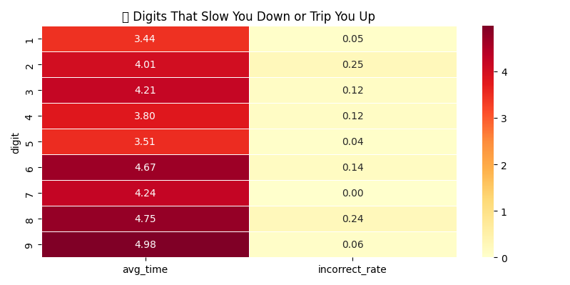
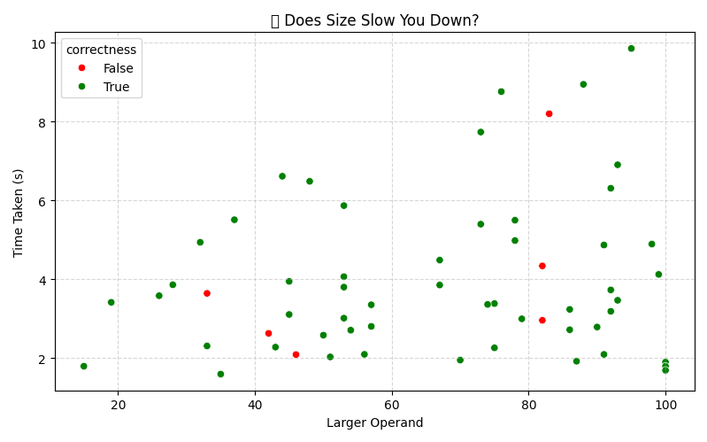

# Math Drill

**A timed arithmetic drill that tells you *which digits* are slowing you down.**

Most drill apps give you a score. This one logs every answer with millisecond
timing and keeps the operands as numbers, not just as a rendered string — so it
can go back and answer questions a score never can:

> Operands containing a **9** cost you **4.98s** on average.
> Operands containing a **1** cost you **3.44s**.
> Additions that carry cost **1.4s more** than additions that don't.

That is the point of the project. The drill exists to generate the data; the
feature extraction is what makes the data worth having.




> **About those screenshots:** they were generated from a much larger practice
> log that no longer exists in this repo. The committed sample data is a single
> session of 9 questions — enough to prove the pipeline runs, nowhere near
> enough for the comparisons to mean anything. See
> [How much data you need](#how-much-data-you-need).

---

# Why I Built this
As someone preparing for quantitative finance and data-intensive roles, I wanted a tool that not only drills arithmetic speed but also tracks and analyzes improvement over time.

This project combines my interests in Python development, data visualization, and performance optimization into a practical, interactive tool.

It’s designed to:
- Simulate high-pressure, time-bound calculations common in finance, analytics, and tech assessments
- Provide data-backed insights to identify strengths and weaknesses
- Demonstrate my ability to build complete, user-friendly applications with analytics capability

---

## What it measures

Every answered question is scored against a set of derived features, and each
feature is compared **against its own opposite** — the difference is the
insight, not the absolute time.

| Feature | What it asks |
|---|---|
| `has_1` … `has_9` | Does either operand contain this digit, anywhere in it? |
| `is_carry_addition` | Does the addition carry into the tens? (17+25 yes, 12+13 no) |
| `is_borrow_subtraction` | Does the subtraction borrow? (32−17 yes, 38−12 no) |
| `is_round_operand_1/2` | Is that operand a multiple of 10? |
| `num_digits_op1/op2` | How long is each operand? |
| `operand_diff` | How far apart are the two operands? |
| `max_operand` | How big is the larger one? |

Boolean features compare their true set against their false set. Numeric
features are **binned**, and each bin is compared against the overall mean.

## Install

Requires **Python 3.10+**.

```sh
git clone https://github.com/aman25singh/math-drill.git
cd math-drill
python -m venv .venv
.venv\Scripts\activate        # Windows
source .venv/bin/activate     # macOS / Linux

pip install -e .
```

Or, for the pinned set:

```sh
pip install -r requirements.txt
```

### A note on Tkinter

**Tkinter is not in `requirements.txt`, and must not be.** It ships with
CPython and is not installable from PyPI. It used to be listed there, which
made `pip install -r requirements.txt` fail for everyone who cloned the repo.

On most Debian/Ubuntu systems it is packaged separately:

```sh
sudo apt install python3-tk
```

The python.org installers for Windows and macOS include it already.

## Run

```sh
math-drill                          # the drill
math-drill-insights                 # analyse every session
math-drill-insights "<session>"     # analyse one session
```

Equivalently, without the console entry points:

```sh
python -m mathdrill.app
python -m mathdrill.insights
```

Useful flags:

```sh
math-drill-insights --file path/to/session_insights.json
math-drill-insights --save charts.png     # write a PNG instead of opening a window
```

## Where your data goes

Sessions are appended to `session_insights.json`, resolved in this order:

1. `$MATHDRILL_DATA_DIR`, if set.
2. `<repo>/Data/` when running from a source checkout.
3. A per-user data directory (`%LOCALAPPDATA%\math-drill` on Windows,
   `~/.local/share/math-drill` elsewhere) when pip-installed.

The path is always absolute. It used to be the bare relative string
`"Data/session_insights.json"`, so where a session got saved depended on
whatever directory you happened to launch the app from.

Writes are atomic — the file is written to a temporary file and moved into
place — so an interrupted save cannot truncate your history.

## Data contract

Every answered question produces one flat record. **Storing the operands
separately from the rendered question string is exactly what makes the
digit-level feature extraction possible.** Treat this as the stable contract
between the desktop app and any future frontend.

```json
{
  "timestamp": 1754847942.753827,
  "question": "25 - 25",
  "operation": "sub",
  "operand_1": 25,
  "operand_2": 25,
  "correct_answer": 0,
  "user_answer": 0.0,
  "time_taken_sec": 2.0723612308502197,
  "correctness": true
}
```

Wrapped per session:

```json
{ "session_name": "...", "duration": 120, "insights": [ ... ] }
```

`operation` is one of `add`, `sub`, `mul`, `div`. `user_answer` is `null` when
the entry was not a number.

> **Schema change:** records used to carry a `question_type` field that was
> always identical to `operation`. It is no longer written. Existing logs
> containing it still load — the reader maps it onto `operation` and drops it.

## How much data you need

The analytics are comparative, so they need volume before they say anything
true:

- **Under ~20 answers** — the charts render, but treat every comparison as
  noise. The tool prints a warning at this point.
- **A few hundred answers across several sessions** — digit and carry
  comparisons start to separate from noise.
- Any feature group with fewer than 5 questions on **either** side of the
  comparison is skipped rather than shown with a misleading average.

The sample log committed here holds **one session of 9 questions**. It is there
so the pipeline has something to chew on, not because it demonstrates anything.

## Two deliberate design choices

**Division is always exact.** The dividend is built as `divisor × quotient`, so
there is never a remainder. Asking for a decimal quotient would change what you
have to type and what "correct" means. A consequence: the old
`is_decimal_division` feature flag could never be true, and `is_exact_division`
was always true for division rows. Both were dead, and both have been removed
rather than left in place looking meaningful.

**Subtraction can go negative.** Subtraction draws from the *addition* ranges
and may order the operands either way, so `2 - 100` is a legitimate question.
That is deliberate drilling practice, but it used to be an accident of the code
rather than a decision. It is now a checkbox on the setup screen
(`allow_negative_answers`), on by default.

## Project layout

```
mathdrill/
  core.py        drill logic: config, question generation, scoring, records
  features.py    feature extraction and metrics (pandas; no plotting)
  storage.py     session JSON load/save and validation
  app.py         Tkinter setup screen
  game_frame.py  Tkinter drill screen
  insights.py    matplotlib/seaborn charts
tests/           pytest suite; no GUI, no real data file
```

`core.py`, `features.py` and `storage.py` import **neither tkinter nor
matplotlib**. The drill logic and the analysis are usable from a CLI, a test,
or a future web port without dragging a GUI along.

## Development

```sh
pip install -e ".[dev]"

pytest                # 85 tests
ruff check .
ruff format --check .
pip-audit
```

`pytest` treats `FutureWarning` and `DeprecationWarning` as errors, so pandas
and seaborn deprecations surface as test failures rather than console noise.

## License

[MIT](LICENSE)
